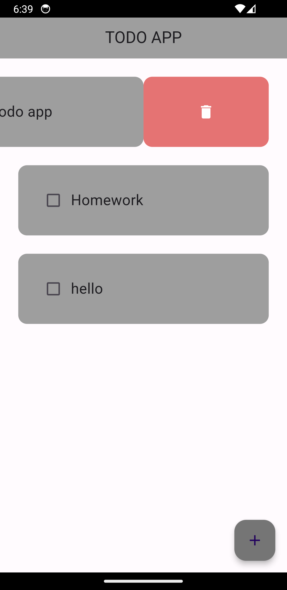

# Todo App

This Flutter project is a simple todo application where users can manage their tasks by adding, editing, and deleting them. The app provides an intuitive user interface to streamline task management.

## Features

- **Add Task**: Users can easily add new tasks to their todo list.
- **Edit Task**: Existing tasks can be edited to update their details.
- **Delete Task**: Users can remove tasks from their todo list.
- **Mark Task as Completed**: Tasks can be marked as completed to keep track of progress.

## Screenshots
### UI

### Mark as Done!

### Adding Task

### Deleting Task

### Editing Task

## APK Link
[Download Todo App APK](https://drive.google.com/file/d/1K3m-XflWhSRHje0toGhQH5B9lSquTTAT/view?usp=drive_link)

Feel free to explore the app and organize your tasks more efficiently!
